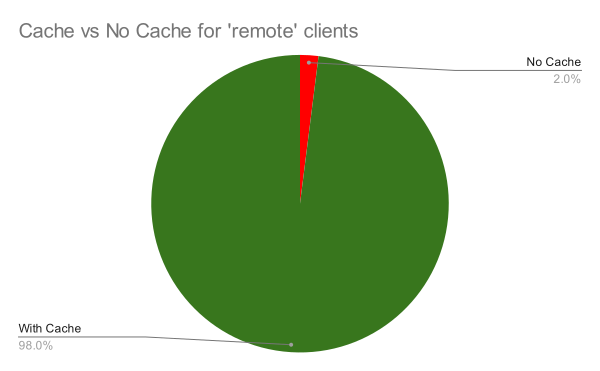

Mitigating Long Distance Network Latencies with Oracle Client Result Cache
==========================================================================

Recently Pythian was engaged to investigate the performance of an application that was reported as performing poorly for remote clients.

At times users would wait 10-15 seconds for some screens to populate.

This may not seem such a long time at first.  

Imagine though you are at the front desk of a medical practice office, admitting patients.

Those few seconds add up quickly, particularly when there are multiple folks queued up.

## SQL Tracing

To find out where the time was being spent by this application, SQL tracing was enabled on multiple clients for a period of time.

Then the trace files were gathered up, and we began analyzing the data.

Trace data generated by the application was analyzed with the [Method-R Workbench](https://method-r.com/software/workbench/) tool, [mrskew](https://method-r.com/man/mrskew.pdf).

There are some [free trace file analysis tools(https://ba6.us/node/177) available, however, none of them can perform analysis of the type done by mrskew

The `--where='$dur<1` option is typically used to filter out calls lasting 1 second or more, which in many cases consists of `SQL*Net message from client calls'.

The SNMFC wait frequently accumulates lengthy wait times, as this is the event seen in trace data when waiting for input from a user.

Tests performed later on are also analyzed with `mrskew`.

Following are some results from tracing the application.


Before getting into the analysis, it seemed a good idea to remember that this trace data is from tracing real applications, used by real users.

While most of the time a user may require more than 1 second between operations that result in the app communicating with the database, there may be occasions where the user can do this in less than 1 second.

It is conceivable, depending on how the app works internally.

A histogram was created of the SNMFC times to get an idea of what should be considered the minimum time for user interaction, if less than 1 second.

```text
$mrskew --name='message from client' --rc=p10.rc  trace*/*.trc
RANGE {min ≤ e < max}                DURATION       %      CALLS          MEAN           MIN           MAX
-----------------------------  --------------  ------  ---------  ------------  ------------  ------------
 1.     0.000000     0.000001
 2.     0.000001     0.000010
 3.     0.000010     0.000100
 4.     0.000100     0.001000       73.820458    0.0%    176,259      0.000419      0.000242      0.000999
 5.     0.001000     0.010000    3,485.986173    0.6%    714,287      0.004880      0.001000      0.009999
 6.     0.010000     0.100000    4,669.279702    0.8%    246,886      0.018913      0.010000      0.099993
 7.     0.100000     1.000000   10,562.221749    1.7%     25,251      0.418289      0.100008      0.999999
 8.     1.000000    10.000000   76,174.497704   12.3%     24,593      3.097406      1.000018      9.999422
 9.    10.000000   100.000000  291,379.130585   46.9%      8,548     34.087404     10.000591     99.936869
10.   100.000000 1,000.000000  229,895.396405   37.0%      1,874    122.676305    100.258822    736.313515
11. 1,000.000000           +∞    5,558.747266    0.9%          3  1,852.915755  1,520.688313  2,459.756552
-----------------------------  --------------  ------  ---------  ------------  ------------  ------------
TOTAL (11)                     621,799.080042  100.0%  1,197,701      0.519161      0.000242  2,459.756552
```

The amount of time occupied by the 0.1 - 1.0 second bucket is only 1.7% of the total wait time.

It is possible that other calls could exceed 1 second as well.  It is not unusual to see any of PARSE,EXEC or FETCH exceed that time.

So, now we can get an idea of max time per call, so that exclusion of calls we do want to influence the output are at least mimimized.

The following summarizes all database calls and system calls from the collection of trace files.


```text
$  mrskew --top=0 --name=:all --sort=7nd  trace*/*.trc
CALL-NAME                               DURATION       %      CALLS      MEAN       MIN           MAX
--------------------------------  --------------  ------  ---------  --------  --------  ------------
SQL*Net message from client       621,799.080042   99.7%  1,197,701  0.519161  0.000242  2,459.756552
FETCH                                 583.095959    0.1%  1,092,840  0.000534  0.000000      6.866308
PARSE                                 898.293746    0.1%    871,812  0.001030  0.000000      1.354290
SQL*Net more data from client          30.262520    0.0%      4,999  0.006054  0.000019      0.378024
EXEC                                  257.789553    0.0%    892,535  0.000289  0.000000      0.352359
SQL*Net more data to client            22.384297    0.0%     55,271  0.000405  0.000038      0.196321
cursor: pin S wait on X                 0.253378    0.0%         14  0.018098  0.001094      0.168761
LOBWRITE                                1.603060    0.0%        600  0.002672  0.000000      0.146709
LOBREAD                                 2.676483    0.0%      1,787  0.001498  0.000000      0.106229
log file sync                          23.853369    0.0%     16,178  0.001474  0.000003      0.106004
db file parallel read                  17.625797    0.0%      4,949  0.003561  0.000024      0.099710
db file sequential read                45.240606    0.0%    134,649  0.000336  0.000009      0.069494
PGA memory operation                   21.200406    0.0%    849,033  0.000025  0.000008      0.023866
CLOSE                                  12.400357    0.0%    886,240  0.000014  0.000000      0.022191
enq: KO - fast object checkpoint        0.043178    0.0%          4  0.010795  0.002090      0.019107
direct path read                        7.410740    0.0%     21,469  0.000345  0.000010      0.016980
LOBGETLEN                               0.583349    0.0%     11,843  0.000049  0.000000      0.012174
SQL*Net break/reset to client           0.049506    0.0%         24  0.002063  0.000003      0.012116
db file scattered read                  0.972713    0.0%      3,443  0.000283  0.000018      0.010542
latch: shared pool                      0.571746    0.0%      1,994  0.000287  0.000001      0.009978
row cache mutex                         0.020823    0.0%         69  0.000302  0.000009      0.009531
library cache: mutex X                  0.015331    0.0%         27  0.000568  0.000008      0.009250
direct path sync                        0.195964    0.0%        119  0.001647  0.000605      0.007678
cursor: pin S                           0.002302    0.0%          2  0.001151  0.001128      0.001174
reliable message                        0.001594    0.0%          4  0.000399  0.000137      0.001095
read by other session                   0.003495    0.0%         15  0.000233  0.000045      0.000931
row cache lock                          0.000987    0.0%          2  0.000494  0.000141      0.000846
latch: cache buffers lru chain          0.000833    0.0%          1  0.000833  0.000833      0.000833
SQL*Net message to client               2.414208    0.0%  1,197,706  0.000002  0.000001      0.000396
Disk file operations I/O                0.056115    0.0%        787  0.000071  0.000036      0.000256
direct path write                       0.153630    0.0%      4,206  0.000037  0.000028      0.000254
latch: In memory undo latch             0.000151    0.0%          1  0.000151  0.000151      0.000151
LOBPGSIZE                               0.004503    0.0%        163  0.000028  0.000008      0.000149
latch: cache buffers chains             0.000054    0.0%          1  0.000054  0.000054      0.000054
library cache: bucket mutex X           0.000103    0.0%          3  0.000034  0.000009      0.000052
asynch descriptor resize                0.000942    0.0%         52  0.000018  0.000016      0.000031
cursor: mutex X                         0.000024    0.0%          1  0.000024  0.000024      0.000024

ERROR                                   0.000000    0.0%         12  0.000000  0.000000      0.000000
XCTEND                                  0.000000    0.0%    795,957  0.000000  0.000000      0.000000
--------------------------------  --------------  ------  ---------  --------  --------  ------------
TOTAL (40)                        623,728.261864  100.0%  8,046,513  0.077515  0.000000  2,459.756552
```

Right away we see that the maximum FETCH time is 6.8 seconds, and the maximum PARSE time is 1.35 seconds.

Now let's get some idea of how prevalent those lengthy times really are.

First, get a histogram of all FETCH calls

```text
$ mrskew --name='FETCH' --rc=p10.rc  trace-2-methodr.trc trace*/*.trc
RANGE {min ≤ e < max}            DURATION       %      CALLS      MEAN       MIN       MAX
-----------------------------  ----------  ------  ---------  --------  --------  --------
 1.     0.000000     0.000001    0.000000    0.0%     89,648  0.000000  0.000000  0.000000
 2.     0.000001     0.000010    0.140694    0.0%     16,614  0.000008  0.000001  0.000010
 3.     0.000010     0.000100   28.348351    4.8%    754,422  0.000038  0.000011  0.000100
 4.     0.000100     0.001000   58.279688   10.0%    168,938  0.000345  0.000101  0.000999
 5.     0.001000     0.010000  272.538200   46.5%     65,797  0.004142  0.001000  0.009999
 6.     0.010000     0.100000   45.677704    7.8%      2,010  0.022725  0.010006  0.099719
 7.     0.100000     1.000000  132.073228   22.6%        529  0.249666  0.100394  0.650443
 8.     1.000000    10.000000   48.537364    8.3%         33  1.470829  1.024624  6.866308
 9.    10.000000   100.000000
10.   100.000000 1,000.000000
11. 1,000.000000           +∞
-----------------------------  ----------  ------  ---------  --------  --------  --------
TOTAL (11)                     585.595229  100.0%  1,097,991  0.000533  0.000000  6.866308
```

The calls that are >= 0.1 seconds make up ~ 31% of all FETCH time, which is a significant amount.

It would be nice to target something between 0.5 and 1.0 seconds as the target to eliminate SNMFC calls that are actually time waiting on user input.

Something around 0.7 seconds would be reasonable.

`$af`: Accounted For time

```text
$ mrskew --name='FETCH' --where='$af >= 0.7' --rc=p10.rc  trace-2-methodr.trc trace*/*.trc
RANGE {min ≤ e < max}           DURATION       %  CALLS      MEAN       MIN       MAX
-----------------------------  ---------  ------  -----  --------  --------  --------
 1.     0.000000     0.000001
 2.     0.000001     0.000010
 3.     0.000010     0.000100
 4.     0.000100     0.001000
 5.     0.001000     0.010000
 6.     0.010000     0.100000
 7.     0.100000     1.000000
 8.     1.000000    10.000000  48.537364  100.0%     33  1.470829  1.024624  6.866308
 9.    10.000000   100.000000
10.   100.000000 1,000.000000
11. 1,000.000000           +∞
-----------------------------  ---------  ------  -----  --------  --------  --------
TOTAL (11)                     48.537364  100.0%     33  1.470829  1.024624  6.866308
```

The check for FETCH calls >= 0.7 seconds shows none in the 0.7 < 1.0 range.

There are however quite a few in the 1.0 < 10.00 range.

If all FETCH calls >= .7 second are not included in the results, the difference in measurement will be minimal.

The entire 583.095959 seconds of FETCH time accounted for only 0.1% of the total time, so we can lose 48.5 seconds of FETCH without any significant difference in the results.

Now for PARSE:

```text
$ mrskew --name='PARSE' --where='$af >= 0.7' --rc=p10.rc  trace-2-methodr.trc trace*/*.trc
RANGE {min ≤ e < max}           DURATION       %  CALLS      MEAN       MIN       MAX
-----------------------------  ---------  ------  -----  --------  --------  --------
 1.     0.000000     0.000001
 2.     0.000001     0.000010
 3.     0.000010     0.000100
 4.     0.000100     0.001000
 5.     0.001000     0.010000
 6.     0.010000     0.100000
 7.     0.100000     1.000000  26.019180   95.1%     35  0.743405  0.700742  0.989590
 8.     1.000000    10.000000   1.354290    4.9%      1  1.354290  1.354290  1.354290
 9.    10.000000   100.000000
10.   100.000000 1,000.000000
11. 1,000.000000           +∞
-----------------------------  ---------  ------  -----  --------  --------  --------
TOTAL (11)                     27.373470  100.0%     36  0.760374  0.700742  1.354290
```

Again, even though 27.37 seconds of PARSE time will not be included in the report for all trace files when accounted for time ($af) is limited to 0.7 seconds, the amount of time will not be significant in the report.


Now to get an overview of where this app spends its time from a performance analysis perspective. This command is similar to a previous one shown, but now any SNMFC >= 0.7 seconds will not be included in the report.


```text
$ mrskew  --where='$af < 0.7'  trace*/*.trc
CALL-NAME                           DURATION       %      CALLS      MEAN       MIN       MAX
-----------------------------  -------------  ------  ---------  --------  --------  --------
SQL*Net message from client    14,151.167569   88.4%  1,157,586  0.012225  0.000242  0.699830
PARSE                             870.920276    5.4%    871,776  0.000999  0.000000  0.699497
FETCH                             534.558595    3.3%  1,092,807  0.000489  0.000000  0.650443
EXEC                              257.789553    1.6%    892,535  0.000289  0.000000  0.352359
db file sequential read            45.240606    0.3%    134,649  0.000336  0.000009  0.069494
SQL*Net more data from client      30.262520    0.2%      4,999  0.006054  0.000019  0.378024
log file sync                      23.853369    0.1%     16,178  0.001474  0.000003  0.106004
SQL*Net more data to client        22.384297    0.1%     55,271  0.000405  0.000038  0.196321
PGA memory operation               21.200406    0.1%    849,033  0.000025  0.000008  0.023866
db file parallel read              17.625797    0.1%      4,949  0.003561  0.000024  0.099710
29 others                          29.435569    0.2%  2,926,546  0.000010  0.000000  0.168761
-----------------------------  -------------  ------  ---------  --------  --------  --------
TOTAL (39)                     16,004.438557  100.0%  8,006,329  0.001999  0.000000  0.699830
```

This app spends about 88% of its time waiting on SQL\*Net traffic.  This is rather a lot of time.

What is happening is that a request is made to the database, and the database responds by sending data to the client. 

The database instance then waits for the application to ack the response.

This is time that could well be spent by the application doing work, rather than spending so much time acknowledging packets.

Frequently this type of behavior occurs when an application requests a single row at a time from the database.

Maybe you are familiar with the term 'row-by-row' processing, as popularized by Tom Kyte.

The term not the practice; Tom Kyte is definitely against row-by-row processing.

If you are not familiar with Tom Kyte, he was the originator of the very popular Oracle site, [Ask Tom](https://asktom.oracle.com/).

You may have experienced the impact of row-by-row processing yourself by experimenting with the 'arraysize' setting in sqlplus.

If not, here is a simple test that will show the significance of this concept.

The test script:

```sql
--j.sql
set term off
set timing on
spool j.log
select * from all_objects;
spool off
set term on
host tail -4 j.log
```

The test session:

```text
SQL# set arraysize 100
SQL# @j

68109 rows selected.

Elapsed: 00:00:13.32


SQL# set arraysize 1
SQL# @j

68109 rows selected.

Elapsed: 00:00:23.27
```

An additional 10 seconds were required for the same query when arraysize was changed from 100 to 1.

And that is with the client located physically next to the database. The waits are greatly magnified with additional network latency.

We can use `mrskew` to find out just how many rows are returned at a time with this application.

```text
$ mrskew --name=:dbcall --group='$r' --group-label='rows' trace*/*.trc
       rows      DURATION       %      CALLS      MEAN       MIN       MAX
-----------  ------------  ------  ---------  --------  --------  --------
          0  1,124.512143   64.0%  3,669,419  0.000306  0.000000  1.354290
          1    532.790386   30.3%    697,012  0.000764  0.000000  2.764739
          2     16.039232    0.9%    122,839  0.000131  0.000000  0.468920
        200     14.690736    0.8%      2,946  0.004987  0.000000  0.483858
         19      7.215690    0.4%        212  0.034036  0.000000  6.866308
        120      6.254791    0.4%      1,786  0.003502  0.000059  0.011138
          7      4.293085    0.2%      2,530  0.001697  0.000000  0.062482
          6      3.065380    0.2%      4,424  0.000693  0.000000  0.084583
         18      2.895639    0.2%        745  0.003887  0.000000  0.048260
          3      2.243636    0.1%      2,060  0.001089  0.000000  0.200572
 187 others     42.446292    2.4%     49,816  0.000852  0.000000  0.648143
-----------  ------------  ------  ---------  --------  --------  --------
TOTAL (197)  1,756.447010  100.0%  4,553,789  0.000386  0.000000  6.866308
```

94.4% of the time spent retrieving data has been spent retrieving zero or one rows.

That is quite significant.  It would be great if that could be reduced.

One way might be by increasing the `arraysize` or equivalent parameter, if available.

In this case, that parameter, or something like it, is not available.

The following questions are raised by this result:  

* Are those 1 row packets being sent because application has submitted a SQL query that is expected to return only 1 row?
* Or is the app configured to retrieve one row at a time, regardless of the number of rows that may be returned?

The fact that some FETCH calls return 200 rows suggests that there may be many queries that simply return 0 or 1 row.

Now we can look for the SQL statements consuming the most time in terms of SNMFC, and drill down further from there.

Note: some SQL is intentionally obfuscated

```text
$  mrskew --name='message from client' --where='$af < 0.7' --group='$sqlid . ":" . substr($sql,0,60)'  trace*/*.trc
$sqlid . ":" . substr($sql,0,60)                                                 DURATION       %      CALLS      MEAN       MIN       MAX
--------------------------------------------------------------------------  -------------  ------  ---------  --------  --------  --------
8j53dscbsbqmb:SELECT H.* FROM HOLIDAY H WHERE ( H."Clinic" = 0 OR H."Clini   1,270.682768    9.0%     41,910  0.030319  0.001445  0.698968
02xpam19gsy6q:SELECT "User", "Key", "Value" FROM DSETTING WHERE "Key" = :p     986.568287    7.0%      1,819  0.542368  0.001488  0.697195
4nf825y4j3sqp:SELECT "Access" FROM ATACCESS WHERE "AtTab" = 94 AND "SLevel     898.422290    6.3%     16,704  0.053785  0.001834  0.695050
204trnv7gujxn:SELECT COUNT(1) FROM AP_NOTE WHERE "AP_NOTE_AppId" = :1 AND      702.007396    5.0%     53,989  0.013003  0.001076  0.698291
0sh4pkr39vszs:SELECT N.*, U."User", U."Name", U."First", U."Middle", AU."U     366.166472    2.6%     58,694  0.006239  0.000847  0.330926
a326j107p6xwr:SELECT * FROM XXXXXXXXXXXXXXXXXXX                                313.086716    2.2%        711  0.440347  0.001365  0.699289
62cj7g3wth5cm:SELECT APPTIND_ORREFSTS_F(:1) FROM DUAL                          206.103814    1.5%     27,075  0.007612  0.002896  0.695297
9kryabxshpaaf:SELECT XXXXXXXXXXXXXXXXXXXXXXXXXXXXXXXXXXXXXXXXXXXXXXXXXXXXX     202.924836    1.4%        919  0.220810  0.000707  0.696312
#0:#0                                                                          187.300853    1.3%     24,270  0.007717  0.000308  0.695110
duk76j6wh17dd:SELECT COUNT(1) FROM NPATTACH WHERE "Id" = :1 AND "Type" = 1     136.644058    1.0%     26,289  0.005198  0.001111  0.327277
68,713 others                                                                8,881.260079   62.8%    905,206  0.009811  0.000242  0.699830
--------------------------------------------------------------------------  -------------  ------  ---------  --------  --------  --------
TOTAL (68,723)                                                              14,151.167569  100.0%  1,157,586  0.012225  0.000242  0.699830
```

The SQL statement 8j53dscbsbqmb is responsible for 9% of SNMFC time across 368 trace files.

As 9% is an average, it will not apply equally for all users.

If we can significantly reduce the SNMFC time for 8j53dscbsbqmb, some users may not even notice, while others may experience a great improvement.

It really depends on which part of the app the user is working with.

The trace files were collected at several different times.

One set of trace files indicates that users were spending 27% of application use time waiting on SNMFC for this one SQL statement.

These users are quite likely to notice any performance improvement made for reducing SNMFC for sqlid 8j53dscbsbqmb.


## Client Result Cache

Client Result Cache was introduced in Oracle 11.2.
Client Result Cache was introduced in [Oracle 11.2.0.1](https://apex.oracle.com/pls/apex/features/r/dbfeatures/features?feature_id=16), and is available on all editions of Oracle.

The purpose of CRC is to cache values in the client after they have been retrieved from the database.

This feature may not be appropriate for volatile data, but for data that only rarely changes, the savings for remote clients could be significant.

The premise is to dedicate a few megabytes of memory at each client for caching SQL results.

Subsequent queries may be satisfied from the cache, rather than making a SQL\*Net round trip.

The requirements for enabling CRC may be seen here: [Configuring the Client Result Cache](https://docs.oracle.com/en/database/oracle/oracle-database/19/tgdba/tuning-result-cache.html#GUID-21CAA1E7-9E46-4442-9F3E-CE09EEF60D92)

In general, CRC is fairly easy to enable.  The following parameters must be set in the database instance.

1 client_result_cache_size
  - must be set to 32768 or greater
  - set to 1048576 for testing
  - changing the value requires restarting the database instance
2 client_result_cache_lag
  - set to 60000 for testing
  - changing the value requires restarting the database instance
3 compatible
  - must be 11.2.0.0.0 or higher

The use of the result cache can be controlled by the following

1 result_cache_mode
  - set to MANUAL or FORCE at the session/system level
  - default is MANUAL
  - affects all tables
2 annotate tables to cache
  - annotate tables with MANUAL or FORCE
  - SQL: alter table table_name result_cache (mode [manual|force])

The testing done here will be controlled by table annotation.

There is a limitation on the use of Client Result Cache:  the application must be one that is built with the Oracle Call Interface (OCI)

Fortunately the DBD::Oracle module that is installed with Oracle is built with OCI.  This means the Perl that is included with Oracle can be used to run the tests. The client application is also built using OCI, so any positive test results can be used to configure CRC for the client application.


## Test Configuration

The testing will be run via the 'result-cache' branch of sqlrun: [sqlrun: result-cache](https://github.com/jkstill/sqlrun/tree/result-cache)


[sqlrun](https://github.com/jkstill/sqlrun) is a tool I developed for running SQL statements against a database using 1+ sessions.  It is highly configurable, following are some of the parameters and configuration possibilities:

* number of sessions
* think time between executions
* connection timing
** connect all simultaneously
** connect as quickly as possible, in succession
** interval between connections
* Multiple SQL statements can be run
* randomize frequency of statements run
* Placeholder values (bind variables) can be supplied from a text file.
* DML can be used
* PL/SQL blocks can be used

Additionally, the branch used in this article has been heavily modified to include some features useful for this test, namely the --pause-at-exit, --xact-tally,  --xact-tally-file, and --client-result-cache-trace options.

Though initially developed for use with Oracle databases, sqlrun can also work with MySQL and PostgreSQL.

Further details are found in the README.md in the github repo.

The following Bash script is used as a driver:

```bash
#!/usr/bin/env bash


# convert to lower case
typeset -l rcMode=$1

set -u

[[ -z $rcMode ]] && {

   echo
   echo include 'force' or 'manual' on the command line
   echo
   echo eg: $0 force
   echo

   exit 1

}


# another method to convert to lower case
#rcMode=${rcMode@L}

echo rcMode: $rcMode

case $rcMode in
   force|manual) ;;
   *) echo
      echo "arguments are [force|manual] - case is unimportant"
      echo
      exit 1;;
esac


db='lestrade/orcl.jks.com'
username='jkstill'
password='grok'

# annotate the tables appropriately
unset SQLPATH ORACLE_PATH
sqlplus -L /nolog <<-EOF

   connect $username/$password@$db
   @@result-cache-dental-config/${rcMode}.sql

   exit

EOF

timestamp=$(date +%Y%m%d%H%M%S)
traceDir=trace/${rcMode}-${timestamp}
rcLogDir=rclog
rcLogFile=$rcLogDir/rc-${rcMode}-${timestamp}.log
traceFileID="RC-${timestamp}"

mkdir -p $traceDir
mkdir -p $rcLogDir

./sqlrun.pl \
   --exe-mode sequential \
   --connect-mode flood \
   --tx-behavior commit \
   --max-sessions 20 \
   --exe-delay 0 \
   --db "$db" \
   --username $username \
   --password "$password" \
   --runtime 1200 \
   --tracefile-id $traceFileID \
   --trace \
   --xact-tally \
   --xact-tally-file  $rcLogFile \
   --pause-at-exit \
   --sqldir $(pwd)/SQL


# cheating a bit as I know where the trace file are on the server
# lestrade.jks.com:/opt/oracle/diag/rdbms/orcl/orcl/trace/orcl_ora_24103_RC-20230703142522.trc
scp -p oracle@lestrade.jks.com:/opt/oracle/diag/rdbms/orcl/orcl/trace/orcl_ora_*_${traceFileID}*.trc $traceDir

echo
echo Trace files are in $traceDir/
echo RC Log is $rcLogFile
echo
```

There are only two tables involved, CHAIR and HOLIDAY.

CHAIR refers to Dental chairs, which will change infrequently.

HOLIDAY refers to annual holidays.  This data normally changes only once per year.

The total number of rows for both table is low:

CHAIR: 122
TABLE: 602

Here is the SQL to be tested:

```sql
SELECT H.* FROM HOLIDAY H WHERE ( H.CLINIC = 0 OR H.CLINIC = (SELECT C.CLINIC FROM CHAIR C WHERE C.CHAIR = :1)) AND H.STARTDATE <= :2 AND H.ENDDATE >= :2 AND H.PARTIALDAY = 0 ORDER BY H.ID DESC
```

sqlrun will execute this statement in 20 sessions, for 20 minutes, as quickly as they can be run.

Bind variable values are read from a text file.


## Testing

The testing will also use the `mrskew` option of `--where='$af<1'` to get test results, just as it was against the trace data from the application.

As discussed previously, the 0.7 second value was used to discern between application induced SNMFC and user induced SNMFC.

In automated testing there would normally be no such waits, but as seen later, there are two possible causes of lengthy SNMFC waits in this testing.

The standard value of 1 second will be used, as there are no 'users'.  There may be some lengthy SNMFC values caused by Client Result Cache, and one caused the test harness.

Each test will consist of 20 clients, each running for 20 minutes, with sql trace enabled.

The tracing is at level 12, so it included waits as well as bind variable values.

A total of 4 tests will be run:

* No additional network latency (client and database are co-located)
** without Client Result Cache
** with Client Result Cache
* Network latency of ~6ms added to simulate client 100 miles distant from database server.
** without Client Result Cache
** with Client Result Cache

The driver script `sqlrun-rc.sh` will call sqlplus and run a script to set table annotations to FORCE or MANUAL for the tests.

FORCE: the client will use client result cache
MANUAL: the client will not use client result cache


## Test Environment

The test environment is as follows:

* Database Server:
** Lestrade
** i5 with single socket and 4 cores
** 32 G RAM
** 1G network
* Client 1
** Poirot
** VM with 3 vCPUs
** 8G RAM
* Client 2
** sqlrun
** VM with 3 vCPUs
** 8G RAM

Oracle database is 19.3
Oracle clients are 19.16
Test software is Perl 5, with the DBI and DBD::Oracle modules


## Without Result Cache, no additional network latency

This is a large set of trace files, and it does take some time to process on this VM.

```text
$  du -sh trace/manual-20230830153724
15G     trace/manual-20230830153724
```

```text
$  time mrskew --where='$af < 1' trace/manual-20230830153724/*.trc
CALL-NAME                         DURATION       %       CALLS      MEAN       MIN       MAX
---------------------------  -------------  ------  ----------  --------  --------  --------
SQL*Net message from client  18,681.266376   88.2%  18,253,315  0.001023  0.000169  0.063483
FETCH                         1,529.259314    7.2%  18,253,235  0.000084  0.000000  0.001037
EXEC                            902.449553    4.3%  18,253,275  0.000049  0.000000  0.005300
log file sync                    29.196260    0.1%         742  0.039348  0.005203  0.919955
SQL*Net message to client        19.594399    0.1%  18,253,335  0.000001  0.000000  0.011659
resmgr:cpu quantum               13.547097    0.1%      17,186  0.000788  0.000010  0.050825
cursor: pin S                     6.535397    0.0%       4,852  0.001347  0.001009  0.024545
ADR block file read               0.244540    0.0%          40  0.006114  0.000068  0.010877
library cache: mutex X            0.051236    0.0%          14  0.003660  0.000004  0.045247
buffer busy waits                 0.010421    0.0%          22  0.000474  0.000002  0.002212
11 others                         0.016493    0.0%         402  0.000041  0.000000  0.004231
---------------------------  -------------  ------  ----------  --------  --------  --------
TOTAL (21)                   21,182.171086  100.0%  73,036,418  0.000290  0.000000  0.919955

real    2m26.069s
user    2m7.695s
sys     0m17.999s
```

### Client Result Cache Stats, no additional network latency

These statistics were collected after the sessions had completed the test, but before disconnecting from the database.

These results just serve as a control, because as you can see, there was no caching, as indicated by the 'Find Count' column.

```text
SYS@lestrade/orcl.jks.com AS SYSDBA> @crc-stats
                                                                                    Block  Block         Create  Create  Delete Delete            Hash
                                                                                    Count  Count  Block   Count   Count   Count  Count     Find Bucket Invalidation
USERNAME               SID SERIAL# MACHINE                        OSUSER          Current    Max   Size Failure Success Invalid  Valid    Count  Count        Count
-------------------- ----- ------- ------------------------------ --------------- ------- ------ ------ ------- ------- ------- ------ -------- ------ ------------
JKSTILL                 37   60891 poirot.jks.com                 jkstill             128   4096    256       0       0       0      0        0   1024            0
JKSTILL                 39   18623 poirot.jks.com                 jkstill             128   4096    256       0       0       0      0        0   1024            0
JKSTILL                 43   12909 poirot.jks.com                 jkstill             128   4096    256       0       0       0      0        0   1024            0
JKSTILL                 44   45488 poirot.jks.com                 jkstill             128   4096    256       0       0       0      0        0   1024            0
JKSTILL                 46   36630 poirot.jks.com                 jkstill             128   4096    256       0       0       0      0        0   1024            0
JKSTILL                 50   52132 poirot.jks.com                 jkstill             128   4096    256       0       0       0      0        0   1024            0
JKSTILL                135   32647 poirot.jks.com                 jkstill             128   4096    256       0       0       0      0        0   1024            0
JKSTILL                142     484 poirot.jks.com                 jkstill             128   4096    256       0       0       0      0        0   1024            0
JKSTILL                152   44430 poirot.jks.com                 jkstill             128   4096    256       0       0       0      0        0   1024            0
JKSTILL                160    8770 poirot.jks.com                 jkstill             128   4096    256       0       0       0      0        0   1024            0
JKSTILL                175   62433 poirot.jks.com                 jkstill             128   4096    256       0       0       0      0        0   1024            0
JKSTILL                280    6238 poirot.jks.com                 jkstill             128   4096    256       0       0       0      0        0   1024            0
JKSTILL                284   15317 poirot.jks.com                 jkstill             128   4096    256       0       0       0      0        0   1024            0
JKSTILL                288   19910 poirot.jks.com                 jkstill             128   4096    256       0       0       0      0        0   1024            0
JKSTILL                296   62730 poirot.jks.com                 jkstill             128   4096    256       0       0       0      0        0   1024            0
JKSTILL                299   39149 poirot.jks.com                 jkstill             128   4096    256       0       0       0      0        0   1024            0
JKSTILL                393    3114 poirot.jks.com                 jkstill             128   4096    256       0       0       0      0        0   1024            0
JKSTILL                396   47784 poirot.jks.com                 jkstill             128   4096    256       0       0       0      0        0   1024            0
JKSTILL                407   44754 poirot.jks.com                 jkstill             128   4096    256       0       0       0      0        0   1024            0
JKSTILL                410   15816 poirot.jks.com                 jkstill             128   4096    256       0       0       0      0        0   1024            0
SYS                    173   49359 poirot.jks.com                 jkstill             128   4096    256       0       0       0      0        0   1024            0

21 rows selected.

```

The script `crc-stats.sql`, used to collect the CRC statistics.


```sql
-- crc-stats.sql
-- Client Result Cache Statistics

set linesize 200 trimspool on
set pagesize 100
col username format a20
col sid format 9999
col serial# format 999999
col name format a35 head 'RC Name'
col machine format a30
col osuser format a15

col block_count_current_value	 format 99999 head 'Block|Count|Current'
col block_count_max_value		 format 99999 head 'Block|Count|Max'
col block_size_value				 format 99999 head 'Block|Size'
col create_count_failure_value format 99999 head 'Create|Count|Failure'
col create_count_success_value format 99999 head 'Create|Count|Success'
col delete_count_invalid_value format 99999 head 'Delete|Count|Invalid'
col delete_count_valid_value	 format 99999 head 'Delete|Count|Valid'
col find_count_value				 format 9999999 head 'Find|Count'
col hash_bucket_count_value	 format 99999 head 'Hash|Bucket|Count'
col invalidation_count_value	 format 99999 head 'Invalidation|Count'

with rs as (
	select	*
	from (
		select cache_id, name, value from client_result_cache_stats$ 
	)
	pivot
	(
		--max(name) "NAME"
		max(value) "VALUE"
		for name in (
			'Block Count Current'	 block_count_current
			,'Block Count Max'		  block_count_max
			,'Block Size'				  block_size
			,'Create Count Failure'	  create_count_failure
			,'Create Count Success'	  create_count_success
			,'Delete Count Invalid'	  delete_count_invalid
			,'Delete Count Valid'	  delete_count_valid
			,'Find Count'				  find_count
			,'Hash Bucket Count'		  hash_bucket_count
			,'Invalidation Count'	  invalidation_count
		)
	)
)
select
	s.username
	, s.sid
	, s.serial#
	, s.machine
	, s.osuser
	, block_count_current_value
	, block_count_max_value
	, block_size_value
	, create_count_failure_value
	, create_count_success_value
	, delete_count_invalid_value
	, delete_count_valid_value
	, find_count_value
	, hash_bucket_count_value
	, invalidation_count_value
from gv$session_client_result_cache rc
	join rs on rs.cache_id = rc.cache_id
	join gv$session s on s.sid = rc.sid and s.serial# = rc.serial#
order by username, sid
/
```

### The RC log

Each client kept track of the number of transactions performed, and wrote them out to a log file.

The results when no Client Result Cache is used:

```text
RC-20230830153724-20230703153724: 914535
RC-20230830153724-20230703153724: 917220
RC-20230830153724-20230703153724: 926713
RC-20230830153724-20230703153724: 912156
RC-20230830153724-20230703153724: 902782
RC-20230830153724-20230703153724: 903334
RC-20230830153724-20230703153724: 932879
RC-20230830153724-20230703153724: 926055
RC-20230830153724-20230703153724: 903622
RC-20230830153724-20230703153724: 908904
RC-20230830153724-20230703153724: 900843
RC-20230830153724-20230703153724: 921625
RC-20230830153724-20230703153724: 902627
RC-20230830153724-20230703153724: 910225
RC-20230830153724-20230703153724: 913760
RC-20230830153724-20230703153724: 907505
RC-20230830153724-20230703153724: 898638
RC-20230830153724-20230703153724: 916200
RC-20230830153724-20230703153724: 912823
RC-20230830153724-20230703153724: 920769
```

The total number of transactions is 18,253,215


## With Result Cache

Calculating the results from the trace files is much faster when Client Result Cache is used.

This is due to the much smaller size of the trace files:

```text
$  du -sh trace/force-20230830160541
54M     trace/force-20230830160541
```

```text
$  time mrskew --where='$dur < 1' trace/force-20230830160541/*.trc
CALL-NAME                                     DURATION       %    CALLS      MEAN       MIN       MAX
-------------------------------------------  ---------  ------  -------  --------  --------  --------
SQL*Net message from client                  47.964188   71.3%   59,741  0.000803  0.000174  0.045564
log file sync                                16.691914   24.8%      460  0.036287  0.005590  0.265968
EXEC                                          1.809924    2.7%   60,081  0.000030  0.000000  0.035868
FETCH                                         0.380603    0.6%   60,041  0.000006  0.000000  0.000844
enq: CN - race with txn                       0.060869    0.1%       16  0.003804  0.000678  0.007635
buffer busy waits                             0.059058    0.1%       58  0.001018  0.000001  0.010705
latch free                                    0.051608    0.1%       96  0.000538  0.000001  0.001328
latch: Change Notification Hash table latch   0.051364    0.1%       17  0.003021  0.000559  0.006974
SQL*Net message to client                     0.050983    0.1%   60,141  0.000001  0.000000  0.002998
enq: RC - Result Cache: Contention            0.047657    0.1%      398  0.000120  0.000002  0.002926
17 others                                     0.086466    0.1%      644  0.000134  0.000000  0.011544
-------------------------------------------  ---------  ------  -------  --------  --------  --------
TOTAL (27)                                   67.254634  100.0%  241,693  0.000278  0.000000  0.265968

real    0m0.558s
user    0m0.377s
sys     0m0.138s
```

When comparing some of the statistics reported by `mrskew`, you may be wondering if these 2 sets of trace files are using the same test criteria.

The test criteria is the same for both tests.  

runtime: 20 minutes
clients: 20

The only difference is whether or not Client Result Cache was being used.

Keep in mind that `mrskew`, or any tool, can only report on what is found in the trace file.

When Client Result Cache is used, the client is retrieving each row from the database only once. Once all rows have been retrieved, there is no need to get more data from the database. All further executions of the test queries are satisfied from the local client cache.

Without CRC, the duration of all waits was 21,182.171086 seconds.

With CRC enabled, the duration of all waits was 67.254634 seconds.

Let's consider the time spent by each of the clients.

During the test without CRC, a total 21,182.171086 seconds was spent in dbcalls or syscalls by the 20 clients.

That is 1,059.1085543 seconds per client on average, waiting on the database or the server:

   21,182.171086/20 = 1,059.1085543

In that case, 88.25% of time the applications were waiting:

   1,059.1085543 / 1200 * 100 = 88.2590461916667

Each client had about 141 seconds available to do whatever work it needed to do.

In this case, the only work is to get more data. as the test SQL statements are repeatedly executed, using a list of bind values for the SQL placeholders.

What about the tests with Client Result Cache enabled?

A total of 67 seconds was spent waiting on dbcalls and syscalls by all 20 clients.

That works out to just 3.3627317 seconds per client, over the course of 20 minutes.

   67.254634 / 20 = 3.3627317

Rather than just 141 seconds of local processing time available to each client, with CRC enabled, there were about 1196 seconds of local processing time availalble per client.

During this test, the only other processing to do is to run the test queries again.

As seen in the Result Count logs, the clients processed many more transactions than the clients that did not use CRC.

### Client Result Cache Stats

These statistics were collected after the sessions had completed the test, but before disconnecting from the database.

Take a look at the 'Find Count' column.  

Each of the 20 clients satisfied queries from local cache over 6 million times.


```text
SYS@lestrade/orcl.jks.com AS SYSDBA> @crc-stats

                   Block  Block         Create  Create  Delete Delete            Hash
                   Count  Count  Block   Count   Count   Count  Count     Find Bucket Invalidation
USERNAME     SID Current    Max   Size Failure Success Invalid  Valid    Count  Count        Count
---------- ----- ------- ------ ------ ------- ------- ------- ------ -------- ------ ------------
JKSTILL       32    3072   4096    256       0    2982       0      0  6319978   1024            0
JKSTILL       33    3072   4096    256       0    2982       0      0  6238234   1024            0
JKSTILL       39    3072   4096    256       0    2982       0      0  6293694   1024            0
JKSTILL       44    3072   4096    256       0    2982       0      0  6257028   1024            0
JKSTILL       47    3072   4096    256       0    2982       0      0  6237394   1024            0
JKSTILL       50    3072   4096    256       0    2982       0      0  6282581   1024            0
JKSTILL      135    3072   4096    256       0    2982       0      0  6254996   1024            0
JKSTILL      152    3072   4096    256       0    2982       0      0  6254007   1024            0
JKSTILL      160    3072   4096    256       0    2982       0      0  6251309   1024            0
JKSTILL      169    3072   4096    256       0    2982       0      0  6311561   1024            0
JKSTILL      175    3072   4096    256       0    2982       0      0  6332953   1024            0
JKSTILL      280    3072   4096    256       0    2982       0      0  6250219   1024            0
JKSTILL      282    3072   4096    256       0    2982       0      0  6285713   1024            0
JKSTILL      284    3072   4096    256       0    2982       0      0  6305114   1024            0
JKSTILL      288    3072   4096    256       0    2982       0      0  6283873   1024            0
JKSTILL      290    3072   4096    256       0    2982       0      0  6281226   1024            0
JKSTILL      393    3072   4096    256       0    2982       0      0  6253926   1024            0
JKSTILL      396    3072   4096    256       0    2982       0      0  6245423   1024            0
JKSTILL      404    3072   4096    256       0    2982       0      0  6288019   1024            0
JKSTILL      422    3072   4096    256       0    2982       0      0  6272817   1024            0
SYS          173     128   4096    256       0       0       0      0        0   1024            0

21 rows selected.
```

### The RC log

Each client kept track of the number of transactions performed, and wrote them out to a log file.

The results when Client Result Cache is used:

```text
RC-20230830160541-20230703160541: 6623000
RC-20230830160541-20230703160541: 6554524
RC-20230830160541-20230703160541: 6599641
RC-20230830160541-20230703160541: 6532840
RC-20230830160541-20230703160541: 6557806
RC-20230830160541-20230703160541: 6584949
RC-20230830160541-20230703160541: 6581603
RC-20230830160541-20230703160541: 6557942
RC-20230830160541-20230703160541: 6551515
RC-20230830160541-20230703160541: 6611476
RC-20230830160541-20230703160541: 6549693
RC-20230830160541-20230703160541: 6573529
RC-20230830160541-20230703160541: 6559698
RC-20230830160541-20230703160541: 6586878
RC-20230830160541-20230703160541: 6590372
RC-20230830160541-20230703160541: 6544219
RC-20230830160541-20230703160541: 6612925
RC-20230830160541-20230703160541: 6593495
RC-20230830160541-20230703160541: 6561719
RC-20230830160541-20230703160541: 6639638
```

The total number of transactions is 131,567,462

This is 7.2 times more transactions than were accomplished without Client Result Cache.

### 60 Second SQL\*Net Message From Client

Now we will specifically look for SNMFC events of about 60 seconds.

```text
$  time mrskew --where='$af >= 1 and $dur < 65' --group='qq{$basename:$line}' --group-label='FILE:LINE'   trace/force-20230830160541/*.trc
FILE:LINE                                                       DURATION       %  CALLS       MEAN        MIN        MAX
---------------------------------------------------------  -------------  ------  -----  ---------  ---------  ---------
orcl_ora_30561_RC-20230830160541-20230703160541.trc:58081      60.002586    0.3%      1  60.002586  60.002586  60.002586
orcl_ora_30574_RC-20230830160541-20230703160541.trc:57602      60.002578    0.3%      1  60.002578  60.002578  60.002578
orcl_ora_30572_RC-20230830160541-20230703160541.trc:57550      60.002518    0.3%      1  60.002518  60.002518  60.002518
orcl_ora_30559_RC-20230830160541-20230703160541.trc:58275      60.002420    0.3%      1  60.002420  60.002420  60.002420
orcl_ora_30572_RC-20230830160541-20230703160541.trc:58278      60.002338    0.3%      1  60.002338  60.002338  60.002338
orcl_ora_30559_RC-20230830160541-20230703160541.trc:57791      60.002131    0.3%      1  60.002131  60.002131  60.002131
orcl_ora_30566_RC-20230830160541-20230703160541.trc:53907      60.002048    0.3%      1  60.002048  60.002048  60.002048
orcl_ora_30566_RC-20230830160541-20230703160541.trc:54640      60.002029    0.3%      1  60.002029  60.002029  60.002029
orcl_ora_30537_RC-20230830160541-20230703160541.trc:55696      60.002002    0.3%      1  60.002002  60.002002  60.002002
orcl_ora_30563_RC-20230830160541-20230703160541.trc:55373      60.001989    0.3%      1  60.001989  60.001989  60.001989
370 others                                                 22,200.553583   97.4%    370  60.001496  60.001281  60.001951
---------------------------------------------------------  -------------  ------  -----  ---------  ---------  ---------
TOTAL (380)                                                22,800.576222  100.0%    380  60.001516  60.001281  60.002586

real    0m0.312s
user    0m0.282s
sys     0m0.029s

```

There is a reason for checking the range of 1-65 seconds.  The value of `client_result_cache_lag` was set to  60000, which is measured in milliseconds.

Every 60 seconds, the oracle client is checking for any updates to the tables where results are being cached at the client. During this time the CRC stats are also updated in the instance.


Consider just one of the trace files:

```text
$  mrskew --top=0 --sort=1a --where='$af >= 1 and $dur < 65' --group='qq{$basename:$line}' --group-label='FILE:LINE'   trace/force-20230830160541/orcl_ora_30561_RC-20230830160541-20230703160541.trc

FILE:LINE                                                      DURATION       %  CALLS       MEAN        MIN        MAX
---------------------------------------------------------  ------------  ------  -----  ---------  ---------  ---------
orcl_ora_30561_RC-20230830160541-20230703160541.trc:53959     60.001474    5.3%      1  60.001474  60.001474  60.001474
orcl_ora_30561_RC-20230830160541-20230703160541.trc:54208     60.001473    5.3%      1  60.001473  60.001473  60.001473
orcl_ora_30561_RC-20230830160541-20230703160541.trc:54450     60.001613    5.3%      1  60.001613  60.001613  60.001613
orcl_ora_30561_RC-20230830160541-20230703160541.trc:54692     60.001452    5.3%      1  60.001452  60.001452  60.001452
orcl_ora_30561_RC-20230830160541-20230703160541.trc:54934     60.001459    5.3%      1  60.001459  60.001459  60.001459
orcl_ora_30561_RC-20230830160541-20230703160541.trc:55176     60.001465    5.3%      1  60.001465  60.001465  60.001465
orcl_ora_30561_RC-20230830160541-20230703160541.trc:55418     60.001504    5.3%      1  60.001504  60.001504  60.001504
orcl_ora_30561_RC-20230830160541-20230703160541.trc:55660     60.001584    5.3%      1  60.001584  60.001584  60.001584
orcl_ora_30561_RC-20230830160541-20230703160541.trc:55902     60.001390    5.3%      1  60.001390  60.001390  60.001390
orcl_ora_30561_RC-20230830160541-20230703160541.trc:56144     60.001480    5.3%      1  60.001480  60.001480  60.001480
orcl_ora_30561_RC-20230830160541-20230703160541.trc:56386     60.001525    5.3%      1  60.001525  60.001525  60.001525
orcl_ora_30561_RC-20230830160541-20230703160541.trc:56628     60.001404    5.3%      1  60.001404  60.001404  60.001404
orcl_ora_30561_RC-20230830160541-20230703160541.trc:56870     60.001481    5.3%      1  60.001481  60.001481  60.001481
orcl_ora_30561_RC-20230830160541-20230703160541.trc:57112     60.001385    5.3%      1  60.001385  60.001385  60.001385
orcl_ora_30561_RC-20230830160541-20230703160541.trc:57354     60.001557    5.3%      1  60.001557  60.001557  60.001557
orcl_ora_30561_RC-20230830160541-20230703160541.trc:57596     60.001628    5.3%      1  60.001628  60.001628  60.001628
orcl_ora_30561_RC-20230830160541-20230703160541.trc:57838     60.001434    5.3%      1  60.001434  60.001434  60.001434
orcl_ora_30561_RC-20230830160541-20230703160541.trc:58081     60.002586    5.3%      1  60.002586  60.002586  60.002586
orcl_ora_30561_RC-20230830160541-20230703160541.trc:58323     60.001456    5.3%      1  60.001456  60.001456  60.001456
---------------------------------------------------------  ------------  ------  -----  ---------  ---------  ---------
TOTAL (19)                                                 1,140.029350  100.0%     19  60.001545  60.001385  60.002586
```

If I pick one of the SNMFC lines, and get the lines following, we can see that the client is consulting with the database to see if the cache needs to be synced.

The following has about 200 lines elided in the name of brevity:

```text
$ mrskew --sort=1a --top=0 --alldep --name=:all -where='$line >= 55660 and $line <= 55660+230' --group='qq{$line:$text}' -gl='LINE:TEXT'   trace/force-20230830160541/orcl_ora_30561_RC-20230830160541-20230703160541.trc

LINE:TEXT                                                                                                                                    DURATION       %  CALLS       MEAN        MIN        MAX
------------------------------------------------------------------------------------------------------------------------------------------  ---------  ------  -----  ---------  ---------  ---------
55660:WAIT #140661336887528: nam='SQL*Net message from client' ela= 60001584 driver id=1952673792 #bytes=1 p3=0 obj#=-1 tim=14522473254855  60.001584   99.9%      1  60.001584  60.001584  60.001584
55661:BINDS #140661335857648:                                                                                                                                                                        
55662:                                                                                                                                                                                               
55663: Bind#0                                                                                                                                                                                        
55664:  oacdty=01 mxl=128(49) mxlc=00 mal=00 scl=00 pre=00                                                                                                                                           
55665:  oacflg=00 fl2=0000 frm=01 csi=873 siz=152 off=0                                                                                                                                              
55666:  kxsbbbfp=7fee4504b8e8  bln=128  avl=10  flg=05                                                                                                                                               
55667:  value="Block Size"                                                                                                                                                                           
...
55683:BINDS #140661335857648:                                                                                                                                                                        
55684:                                                                                                                                                                                               
55685: Bind#0                                                                                                                                                                                        
55686:  oacdty=01 mxl=128(49) mxlc=00 mal=00 scl=00 pre=00                                                                                                                                           
55687:  oacflg=00 fl2=0000 frm=01 csi=873 siz=152 off=0                                                                                                                                              
55688:  kxsbbbfp=7fee4504b8e8  bln=128  avl=15  flg=05                                                                                                                                               
55689:  value="Block Count Max"                                                                                                                                                                      
...
55859:BINDS #140661335857648:                                                                                                                                                                        
55860:                                                                                                                                                                                               
55861: Bind#0                                                                                                                                                                                        
55862:  oacdty=01 mxl=128(49) mxlc=00 mal=00 scl=00 pre=00                                                                                                                                           
55863:  oacflg=00 fl2=0000 frm=01 csi=873 siz=152 off=0                                                                                                                                              
55864:  kxsbbbfp=7fee4504b8e8  bln=128  avl=18  flg=05                                                                                                                                               
55865:  value="Delete Count Valid"                                                                                                                                                                   
55866: Bind#1                                                                                                                                                                                        
55867:  oacdty=02 mxl=22(22) mxlc=00 mal=00 scl=00 pre=00                                                                                                                                            
55868:  oacflg=00 fl2=0000 frm=00 csi=00 siz=0 off=128                                                                                                                                               
55869:  kxsbbbfp=7fee4504b968  bln=22  avl=01  flg=01                                                                                                                                                
55870:  value=0                                                                                                                                                                                      
55871: Bind#2                                                                                                                                                                                        
55872:  oacdty=02 mxl=22(03) mxlc=00 mal=00 scl=00 pre=00                                                                                                                                            
55873:  oacflg=10 fl2=0000 frm=00 csi=00 siz=24 off=0                                                                                                                                                
55874:  kxsbbbfp=7fee4a41ae68  bln=22  avl=03  flg=09                                                                                                                                                
55875:  value=5497                                                                                                                                                                                   
55876: Bind#3                                                                                                                                                                                        
55877:  oacdty=02 mxl=22(22) mxlc=00 mal=00 scl=00 pre=00                                                                                                                                            
55878:  oacflg=00 fl2=0000 frm=00 csi=00 siz=24 off=0                                                                                                                                                
55879:  kxsbbbfp=7fee4504b8b8  bln=22  avl=02  flg=05                                                                                                                                                
55880:  value=10                                                                                                                                                                                     
55881:EXEC #140661335857648:c=964,e=964,p=0,cr=15,cu=11,mis=0,r=10,dep=1,og=4,plh=1807565214,tim=14522473255889                              0.000964    0.0%      1   0.000964   0.000964   0.000964
55882:WAIT #140661335857648: nam='log file sync' ela= 40174 buffer#=158 sync scn=38725244627216 p3=0 obj#=-1 tim=14522473296109              0.040174    0.1%      1   0.040174   0.040174   0.040174
55883:BINDS #140661336887528:                                                                                                                                                                        
55884:                                                                                                                                                                                               
55885: Bind#0                                                                                                                                                                                        
55886:  oacdty=01 mxl=32(30) mxlc=00 mal=00 scl=00 pre=00                                                                                                                                            
55887:  oacflg=05 fl2=1000000 frm=01 csi=873 siz=160 off=0                                                                                                                                           
55888:  kxsbbbfp=7fee45046890  bln=32  avl=04  flg=05                                                                                                                                                
55889:  value="1742"                                                                                                                                                                                 
55890: Bind#1                                                                                                                                                                                        
------------------------------------------------------------------------------------------------------------------------------------------  ---------  ------  -----  ---------  ---------  ---------
TOTAL (231)                                                                                                                                 60.042722  100.0%      3  20.014241   0.000964  60.001584
```

## Simulated Network Latency

In many cases a client may be separated from the server by many miles.

If the client machine is 100 miles away from the database server, we can calculate the time required for a round trip.

### Traffic Control

The tc (traffic control) program can be used to induce latency in a network.

Using this, we can simulate a client that is 100 miles from the database server.

A different VM, 'sqlrun', is being used to run the tests.

As per the following network latency calculator, setting the latency to 6ms should be about right:

[WAN Latency Estimator](https://wintelguy.com/wanlat.html)

The [tc](https://man7.org/linux/man-pages/man8/tc.8.html) utility was used to simulate network latency of ~ 6ms, with a fluctuation of up to 25%.

```text
[root@sqlrun ~]# tc qdisc add dev enp0s3 root netem delay 6ms 1ms 25%

[root@sqlrun ~]# tc qdisc
qdisc netem 8002: dev enp0s3 root refcnt 2 limit 1000 delay 6.0ms  1.0ms 25%
qdisc pfifo_fast 0: dev virbr0-nic root refcnt 2 bands 3 priomap  1 2 2 2 1 2 0 0 1 1 1 1 1 1 1 1

```

As this is a VM that is running on a server about 30 inches from the database server, ping would normally be < 1ms.

Here we see the average at 8.292ms, which for testing purposes, is close enough to our estimate.

(Lestrade is the database server)

```text
[sqlrun]$ ping -c 100 lestrade
PING lestrade.jks.com (192.168.1.116) 56(84) bytes of data.
64 bytes from lestrade.jks.com (192.168.1.116): icmp_seq=1 ttl=64 time=6.94 ms
64 bytes from lestrade.jks.com (192.168.1.116): icmp_seq=2 ttl=64 time=6.82 ms
64 bytes from lestrade.jks.com (192.168.1.116): icmp_seq=3 ttl=64 time=7.33 ms
...
64 bytes from lestrade.jks.com (192.168.1.116): icmp_seq=98 ttl=64 time=6.92 ms
64 bytes from lestrade.jks.com (192.168.1.116): icmp_seq=99 ttl=64 time=7.36 ms
64 bytes from lestrade.jks.com (192.168.1.116): icmp_seq=100 ttl=64 time=6.91 ms

--- lestrade.jks.com ping statistics ---
100 packets transmitted, 100 received, 0% packet loss, time 99181ms
rtt min/avg/max/mdev = 5.304/8.292/25.075/4.329 ms

```

For reference, ping from a different server:

```text
$  ping -c 100 lestrade
PING lestrade.jks.com (192.168.1.116) 56(84) bytes of data.
64 bytes from lestrade.jks.com (192.168.1.116): icmp_seq=1 ttl=64 time=0.229 ms
64 bytes from lestrade.jks.com (192.168.1.116): icmp_seq=2 ttl=64 time=0.263 ms
64 bytes from lestrade.jks.com (192.168.1.116): icmp_seq=3 ttl=64 time=0.254 ms
...
64 bytes from lestrade.jks.com (192.168.1.116): icmp_seq=98 ttl=64 time=0.290 ms
64 bytes from lestrade.jks.com (192.168.1.116): icmp_seq=99 ttl=64 time=0.293 ms
64 bytes from lestrade.jks.com (192.168.1.116): icmp_seq=100 ttl=64 time=0.308 ms

--- lestrade.jks.com ping statistics ---
100 packets transmitted, 100 received, 0% packet loss, time 99270ms
rtt min/avg/max/mdev = 0.209/0.279/0.374/0.032 ms
```````````````````````````

The same script sqlrun-rc.sh was used to run the tests.

The only difference is that sqlrun is now running on a different client machine.

### Simulated Latency without Client Result Cache

Let's have a look at the results.

```text
$  time mrskew --where='$af < 1'  manual-20230831121326/*.trc
CALL-NAME                         DURATION       %       CALLS      MEAN       MIN       MAX
---------------------------  -------------  ------  ----------  --------  --------  --------
SQL*Net message from client  23,189.706550   97.5%   2,756,398  0.008413  0.005198  0.256000
FETCH                           317.882828    1.3%   2,756,318  0.000115  0.000000  0.000912
EXEC                            203.297906    0.9%   2,756,358  0.000074  0.000000  0.004975
log file sync                    61.155541    0.3%         820  0.074580  0.008886  0.802599
SQL*Net message to client         1.553686    0.0%   2,756,418  0.000001  0.000000  0.001248
cursor: pin S                     0.203710    0.0%         187  0.001089  0.001039  0.001466
buffer busy waits                 0.052867    0.0%         104  0.000508  0.000001  0.006587
latch: shared pool                0.034064    0.0%           8  0.004258  0.000006  0.006685
ADR block file read               0.019283    0.0%          40  0.000482  0.000062  0.001759
library cache: mutex X            0.015052    0.0%          28  0.000538  0.000001  0.010585
10 others                         0.031471    0.0%         403  0.000078  0.000000  0.004870
---------------------------  -------------  ------  ----------  --------  --------  --------
TOTAL (20)                   23,773.952958  100.0%  11,027,082  0.002156  0.000000  0.802599

real    0m21.298s
user    0m19.132s
sys     0m2.125s
```

You may have noticed that `mrskew` needed only 22.3 seconds to process the trace files from this test, while earlier the same tests required 2+ minutes.

The reason for that is that the trace files are much smaller:

```text
$  du -sh manual-20230831121326/
2.3G    manual-20230831121326/
```

The trace files from the very first test were from the 'local' client, with a < 1ms network latency. These totaled about 15G.

As the network latency is now at 8.4ms on average, the percentage of SNMFC time is much higher than it was for the 'local' client.  Due to the 8m network latency, the 'remote' client did much less work.

With the induced latency, this client is spending 8x more time waiting on the network than with previous tests, and so SNFMC is consuming 97.5% of time.

#### rc log

Each process on the 'remote' client did only about 137k transactions each.

```text
RC-20230831121326-20230704121326: 137741
RC-20230831121326-20230704121326: 137806
RC-20230831121326-20230704121326: 137757
RC-20230831121326-20230704121326: 137850
RC-20230831121326-20230704121326: 137775
RC-20230831121326-20230704121326: 137981
RC-20230831121326-20230704121326: 137760
RC-20230831121326-20230704121326: 137887
RC-20230831121326-20230704121326: 137773
RC-20230831121326-20230704121326: 137768
RC-20230831121326-20230704121326: 137695
RC-20230831121326-20230704121326: 137898
RC-20230831121326-20230704121326: 138031
RC-20230831121326-20230704121326: 137848
RC-20230831121326-20230704121326: 137878
RC-20230831121326-20230704121326: 137884
RC-20230831121326-20230704121326: 137528
RC-20230831121326-20230704121326: 137767
RC-20230831121326-20230704121326: 137788
RC-20230831121326-20230704121326: 137883
```

The total number of transactions was ~ 2.75M

```text
$  awk '{ x=x+$2 }END{print x}' rclog-network_latency/rc-manual-20230831121326.log
2756298
```

Compare that to the 18.2M performed in the first test on the 'local' client.


### Simulated Latency with Client Result Cache

Now we get the results that we hope will justify all of this testing, running the test on a 'remote' client with Client Result Cache enabled.

At first glance, there does not appear to be much improvement.

After all, the SNMFC has only dropped by 3.1%, from 97.5% to 94.4%.

```text
$  time mrskew --where='$dur < 1'  force-20230831123418/*.trc
CALL-NAME                             DURATION       %    CALLS      MEAN       MIN       MAX
----------------------------------  ----------  ------  -------  --------  --------  --------
SQL*Net message from client         459.712597   94.4%   59,740  0.007695  0.005252  0.073854
log file sync                        21.464715    4.4%      441  0.048673  0.011675  0.152602
EXEC                                  4.516092    0.9%   60,080  0.000075  0.000000  0.033100
FETCH                                 0.849419    0.2%   60,040  0.000014  0.000000  0.000795
enq: RC - Result Cache: Contention    0.077254    0.0%      533  0.000145  0.000007  0.000486
ADR block file read                   0.058727    0.0%       40  0.001468  0.000070  0.012409
enq: CN - race with txn               0.051463    0.0%       15  0.003431  0.000611  0.006732
cursor: pin S wait on X               0.034593    0.0%        6  0.005766  0.004267  0.006668
SQL*Net message to client             0.028325    0.0%   60,140  0.000000  0.000000  0.000025
buffer busy waits                     0.019479    0.0%       80  0.000243  0.000001  0.005459
18 others                             0.042739    0.0%      587  0.000073  0.000000  0.002882
----------------------------------  ----------  ------  -------  --------  --------  --------
TOTAL (28)                          486.855403  100.0%  241,702  0.002014  0.000000  0.152602

real    0m0.451s
user    0m0.439s
sys     0m0.012s
```

As was done previously with the 'local' client, we can compare the actual time available to the app in both scenarios.

Both tests were with 20 clients, each running 1200 seconds.

The total time available in each test is 24,000 seconds. The time accounting is summarized in the following table:

Note: 'Excluded Time' in this case refers to time that is not included in the report.
ie. any wait >= 1 second was excluded from the report.

| Test    | Total | Accounted | Excluded
|         | Time  | for Time  | Time     |
|---------|-------|-----------|----------|
| No CRC  | 24000 | 23,773.0  |    227.0 |
| Use CRC | 24000 |    486.9  | 23,513.1 |


In the case of the tests that were not using CRC,  most of the Excluded Time can be found by looking for $af values between 1 and 59 seconds inclusive.

```text
$  time mrskew --where='$af >=1 and $af <= 59'  manual-20230831121326/*.trc
CALL-NAME                      DURATION       %  CALLS       MEAN        MIN        MAX
---------------------------  ----------  ------  -----  ---------  ---------  ---------
SQL*Net message from client  206.082333  100.0%     20  10.304117  10.284974  10.313397
---------------------------  ----------  ------  -----  ---------  ---------  ---------
TOTAL (1)                    206.082333  100.0%     20  10.304117  10.284974  10.313397

real    0m12.751s
user    0m12.198s
sys     0m0.532s
```

This leaves approximately 21 seconds unaccounted for across the 20 tests. We will not be considering unaccounted time further in this article, other than to acknowledge that it happens.


The result for the test on the 'remote' client with CRC enabled look a bit different:

The trace files for the 'remote' clients using CRC do not have any calls in this time range:

```text
$  time mrskew --where='$af >=1 and $af <= 59'  force-20230831123418/*.trc
mrskew: no calls match where '(($af >=1 and $af <= 59) and ($dep==$depmin)) and ($nam=~/.+/i)' is true

real    0m0.312s
user    0m0.294s
sys     0m0.018s
```

The 'remote' CRC trace files do have a large number of SNFMC in the 60 second range:

```text

$  time mrskew --where='$af >59'  force-20230831123418/*.trc
CALL-NAME                         DURATION       %  CALLS       MEAN        MIN        MAX
---------------------------  -------------  ------  -----  ---------  ---------  ---------
SQL*Net message from client  24,332.499100  100.0%    400  60.831248  60.006347  76.714749
---------------------------  -------------  ------  -----  ---------  ---------  ---------
TOTAL (1)                    24,332.499100  100.0%    400  60.831248  60.006347  76.714749

real    0m0.312s
user    0m0.295s
sys     0m0.017s
```

As seen previously, these ~ 60 second waits are a result of the Client Result Cache algorithm waking up every 60 seconds on the client and checking the status of the tables being cached, and then updating the CRC statistics.

During those 60 seconds, each client process is busy getting results from the local client cache.

This can be seen by looking at the RC log that counts the number of transactions per client, with each client performing about 6.77M transactions on average

```text
RC-20230831123418-20230704123418: 6909541
RC-20230831123418-20230704123418: 7240289
RC-20230831123418-20230704123418: 6694473
RC-20230831123418-20230704123418: 6891337
RC-20230831123418-20230704123418: 6686918
RC-20230831123418-20230704123418: 6374032
RC-20230831123418-20230704123418: 6700690
RC-20230831123418-20230704123418: 6490638
RC-20230831123418-20230704123418: 6802760
RC-20230831123418-20230704123418: 6797183
RC-20230831123418-20230704123418: 6570896
RC-20230831123418-20230704123418: 6839648
RC-20230831123418-20230704123418: 6706639
RC-20230831123418-20230704123418: 6746755
RC-20230831123418-20230704123418: 6732575
RC-20230831123418-20230704123418: 6842443
RC-20230831123418-20230704123418: 6690335
RC-20230831123418-20230704123418: 6496897
RC-20230831123418-20230704123418: 7352803
RC-20230831123418-20230704123418: 6888591
```

The total:

```text
$  awk '{ x=x+$2 }END{print x}' rclog-network_latency/rc-force-20230831123418.log
135455443
```

Cache vs No Cache for 'remote' clients:

|     Mode  | Total Transactions |
|-----------|--------------------|
|No Cache   |    2,756,298       |
|With Cache |  135,455,443       |


The difference is more striking when charted:




With caching, 49x more transactions were processed.

## Conclusion

What might that translate into for a real application?

The SNFMC time for sqlid 8j53dscbsbqmb is 9% for all sessions traced, which was 1,270 seconds.

If the same 49x reduction could be made in SNMFC for this sqlid, then only 25 seconds would be spent on SNFMC for this query.

As this is an average, any change will affect some users more than others.  Those users working in the part of the application that uses this query will likely notice the difference.

It would be great if I could report the time savings from the perspective of the application that was experiencing these performance issues. Unfortunately, those results are not available at this time.

There are likely other queries working with static, or nearly static data, where the tables may be annotated for use with Client Result Cache.

Searching for those may be another blog.

If you would like to explore this topic further, and feel you could use some assistance, please contact Pythian.


